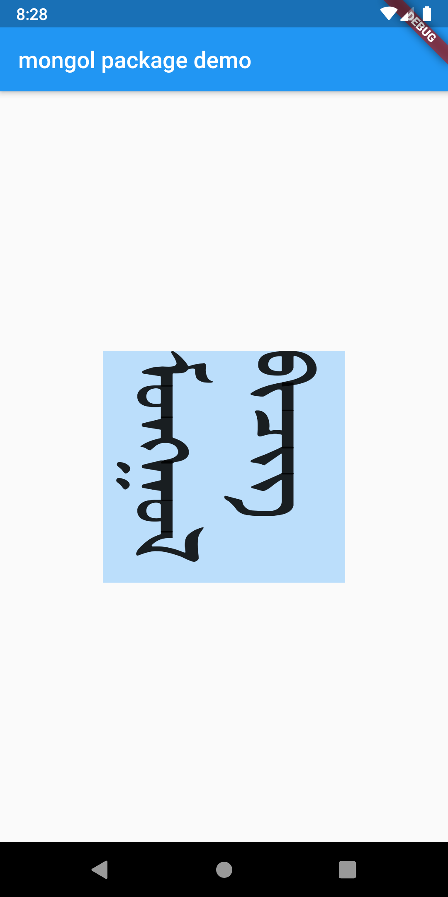

# mongol

Widgets for vertical Mongolian

## Contents

Currently this project only contains a widget called `MongolText`. Use it the same as you would use a standard Flutter `Text` widget.

## TODO

- Add text styling.
- Include a default font.
