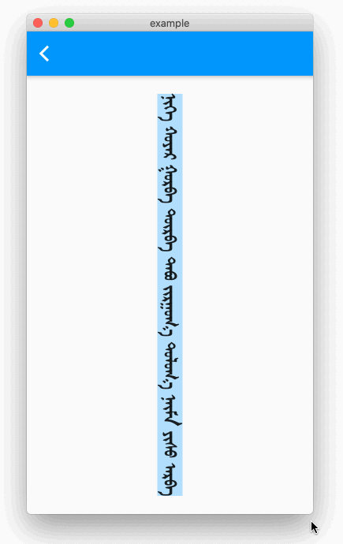
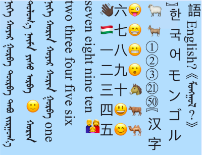
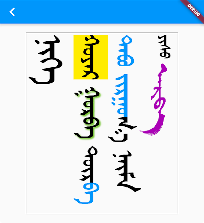
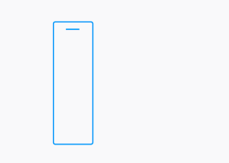
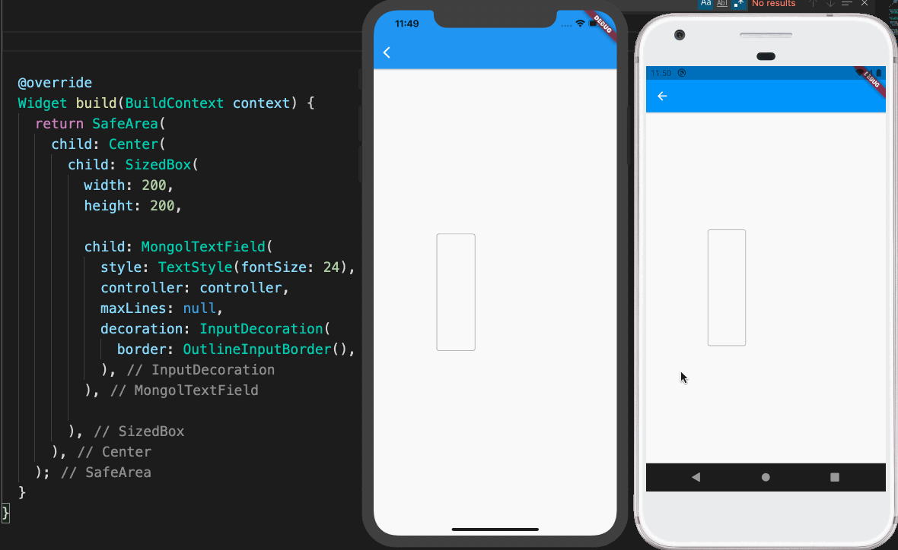
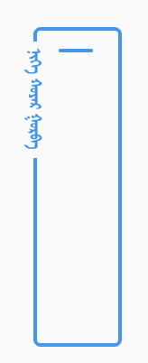
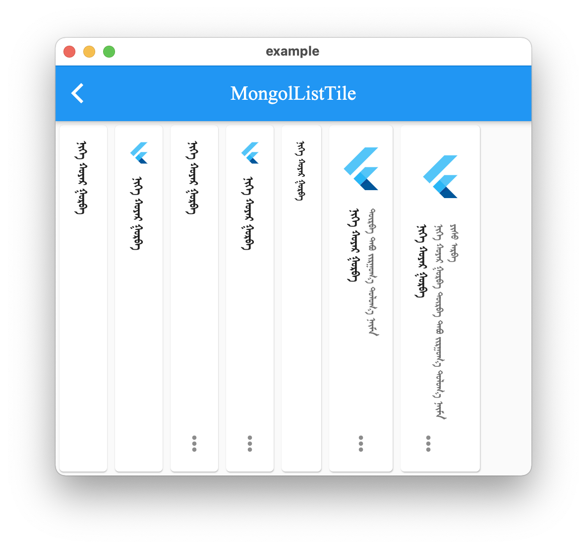
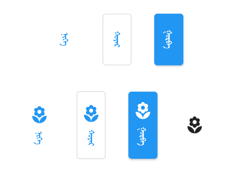
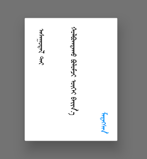

# mongol

This library is a collection of Flutter widgets for displaying traditional Mongolian vertical text.

The primary widgets include:

- `MongolText`: vertical version of `Text`
- `MongolTextField`: vertical version of `TextField`
- `MongolListTile`: vertical version of `ListTile`, for use in horizontal list views and menus
- `MongolPopupMenuButton`: vertical version of `PopupMenuButton`, for displaying menus
- `MongolAlertDialog`: vertical version of `AlertDialog`

## Displaying vertical text

`MongolText` is a vertical text version of Flutter's `Text` widget. Left-to-right line wrapping is supported. 

```dart
MongolText('ᠨᠢᠭᠡ ᠬᠣᠶᠠᠷ ᠭᠤᠷᠪᠠ ᠳᠦᠷᠪᠡ ᠲᠠᠪᠤ ᠵᠢᠷᠭᠤᠭ᠎ᠠ ᠳᠣᠯᠣᠭ᠎ᠠ ᠨᠠᠢᠮᠠ ᠶᠢᠰᠦ ᠠᠷᠪᠠ'),
```

The library supports mobile, web, and desktop.



### Emoji and CJK characters

The library rotates emoji and CJK (Chinese, Japanese, and Korean) characters for proper orientation.



### Text styling

You add styling using `TextSpan` and/or `TextStyle`, just as you would for a `Text` widget.

```dart
MongolText.rich(
  textSpan,
  textScaleFactor: 2.5,
),
```

where `textSpan` is defined like so:

```dart
const textSpan = TextSpan(
  style: TextStyle(fontSize: 30, color: Colors.black),
  children: [
    TextSpan(text: 'ᠨᠢᠭᠡ\n', style: TextStyle(fontSize: 40)),
    TextSpan(text: 'ᠬᠣᠶᠠᠷ', style: TextStyle(backgroundColor: Colors.yellow)),
    TextSpan(
      text: ' ᠭᠤᠷᠪᠠ ',
      style: TextStyle(shadows: [
        Shadow(
          blurRadius: 3.0,
          color: Colors.lightGreen,
          offset: Offset(3.0, -3.0),
        ),
      ]),
    ),
    TextSpan(text: 'ᠳᠦᠷ'),
    TextSpan(text: 'ᠪᠡ ᠲᠠᠪᠤ ᠵᠢᠷᠭᠤ', style: TextStyle(color: Colors.blue)),
    TextSpan(text: 'ᠭ᠎ᠠ ᠨᠠᠢᠮᠠ '),
    TextSpan(text: 'ᠶᠢᠰᠦ ', style: TextStyle(fontSize: 20)),
    TextSpan(
        text: 'ᠠᠷᠪᠠ',
        style:
            TextStyle(fontFamily: 'MenksoftAmuguleng', color: Colors.purple)),
  ],
);
```



This all assumes you've added one or more Mongolian fonts to your app assets.

## Adding a Mongolian font

The library does not include a Mongolian font. This allows the library to be smaller and also gives developers the freedom to choose any Mongolian font they like.

Since it's likely that some of your users' devices won't have a Mongolian font installed, you should include at least one Mongolian font with your project. Here is what you need to do:

### 1. Get a font

You can find a font from the following sources:

- [Menksoft](https://www.mklai.cn/download-font?productId=a0ec7735b5714334934ff3c094ca0a5e)
- [MongolFont](http://www.mongolfont.com/en/font/index.html)
- [BolorSoft](https://www.mngl.net/#download)
- [Z Mongol Code](https://install.zcodetech.com/)
- [CMs font](https://phabricator.wikimedia.org/T130502)

### 2. Add the font to your project

You can get directions to do that [here](https://medium.com/@suragch/how-to-use-a-custom-font-in-a-flutter-app-911763c162f5) and [here](https://flutter.dev/docs/cookbook/design/fonts). 

Basically you just need to create an **assets/fonts** folder for it and then declare the font in **pubspec.yaml** like this:

```yaml
flutter:
  fonts:
    - family: MenksoftQagan
      fonts:
        - asset: assets/fonts/MQG8F02.ttf
```

You can call the family name whatever you want, but this string is what you will use in the next step.

### 3. Set the default Mongolian font for your app

In your `main.dart` file, set the `fontFamily` for the app theme.

```dart
MaterialApp(
  theme: ThemeData(fontFamily: 'MenksoftQagan'),
  // ...
);
```

Now you won't have to manually set the font for every Mongolian text widget. If you want to use a different font for some widgets, though, you can still set the `fontFamily` as you normally would inside `TextStyle`.

You may also consider using [mongol_code](https://pub.dev/packages/mongol_code) with a Menksoft font if your users have devices that don't support OpenType Unicode font rendering. `mongol_code` converts Unicode to Menksoft code, which a Menksoft font can display without any special rendering requirements.

## Editing vertical text

You can use `MongolTextField` to receive and edit text from the system keyboard. This widget includes most of the functionality of the standard Flutter `TextField` widget.



Here is it on iOS and Android interacting with a system keyboard:



If you want to use an outlined text field with a label, use `MongolOutlineInputBorder`:



```dart
MongolTextField(
  decoration: InputDecoration(
    border: MongolOutlineInputBorder(),
    labelText: 'ᠨᠢᠭᠡ ᠬᠤᠶᠠᠷ ᠭᠤᠷᠪᠠ',
  ),
),
```

In order to correctly handle right/left and up/down keys on the web and desktop (or for physical keyboards connected to a mobile app), you need to return the `MongolTextEditingShortcuts` widget from the `builder` method of your `MaterialApp` (or `CupertinoApp` or `WidgetsApp`) at the top of your widget tree:

```dart
MaterialApp(
  builder: (context, child) => MongolTextEditingShortcuts(child: child),
  // ...
)
```

## Horizontal lists

You can display horizontally scrolling lists with the standard `ListView` widget. All you need to do is set the scroll direction to horizontal.

```dart
ListView(
  scrollDirection: Axis.horizontal,
  children: [
    MongolText('ᠨᠢᠭᠡ'),
    MongolText('ᠬᠣᠶᠠᠷ'),
    MongolText('ᠭᠤᠷᠪᠠ'),
  ],
),
```

For something a little fancier, you can also use the `MongolListTile` widget just like you would use `ListTile`. Here is an example from the example project:

```dart
Card(
  child: MongolListTile(
    leading: FlutterLogo(size: 56.0),
    title: MongolText('ᠨᠢᠭᠡ ᠬᠣᠶᠠᠷ ᠭᠤᠷᠪᠠ'),
    subtitle: MongolText('ᠳᠦᠷᠪᠡ ᠲᠠᠪᠤ ᠵᠢᠷᠭᠤᠭ᠎ᠠ ᠳᠣᠯᠣᠭ᠎ᠠ ᠨᠠᠢᠮᠠ'),
    trailing: Icon(Icons.more_vert),
  ),
),
```



## Menus

To add a popup menu with horizontal items, you can use `MongolPopupMenuButton`. It is customizable in all the ways that the standard `PopupMenuButton` is.

```dart
Scaffold(
  appBar: AppBar(
    title: const Text('MongolPopupMenuButton'),
    actions: [
      MongolPopupMenuButton(
        itemBuilder: (context) => const [
          MongolPopupMenuItem(child: MongolText('ᠨᠢᠭᠡ'), value: 1),
          MongolPopupMenuItem(child: MongolText('ᠬᠣᠶᠠᠷ'), value: 2),
          MongolPopupMenuItem(child: MongolText('ᠭᠤᠷᠪᠠ'), value: 3),
        ],
        tooltip: 'vertical tooltip text',
        onSelected: (value) => print(value),
      ),
    ],
  ),
  body: Container(),
);
```


## Buttons

There are Mongol equivalents to all of the Flutter buttons:

- `MongolTextButton`
- `MongolOutlinedButton`
- `MongolElevatedButton`
- `MongolTextButton.icon`
- `MongolOutlinedButton.icon`
- `MongolElevatedButton.icon`
- `MongolIconButton`



The reason for the Mongol icon button is to provide a vertical tooltip that will appear for a longpress on mobile and for a mouse hover on desktop and web.

## Other widgets

### MongolAlertDialog

This alert dialog works mostly the same as the Flutter `AlertDialog`.



### TODO

- Improve keyboard (this may be better as a separate package)
- Various other text based widgets
- Support `WidgetSpan`.
- Add more tests
- For `MongolTextAlign.bottom` don't count final space in line height
- Add `MongolSelectableText` widget